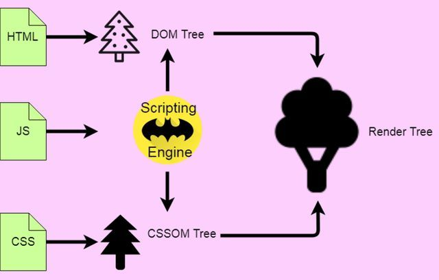

export const meta = require('./metadata.json')

According to [Google](https://www.thinkwithgoogle.com/intl/en-ca/marketing-strategies/app-and-mobile/mobile-page-speed-new-industry-benchmarks/), 53% of visits are abandoned if a mobile site takes longer than three seconds to load. That's a big problem. Thousands of developers look at this issue daily. Thousands of them struggle with the performance of simply dispatching some data online. Yet, it doesn't matter how hard you try to improve your page speed if you don't understand first how the website lifecycle works.

## The lifecycle

Any website follows a serie of steps involving at least one client, one server and a myriad of infrastructure proxies. A word of advice - in order to keep it focused - in this post I'm not gonna discuss the basics of the Internet, HTTP requests, etc. [In short](https://developer.mozilla.org/en-US/docs/Web/Performance/How_browsers_work):

1. The client (i.e. a browser) **request access** to a website.
2. After going through different pieces of *infra*, the request **reaches a server**.
3. ✨ The server then processes the request and **returns one single HTML file**. No JavaScript or CSS whatsoever.
4. The **client then receives** the payload an starts unpacking.
5. **Parse the HTML**.
6. Fetch **other assets** linked in the HTML file, such as JavaScript files, CSS stylesheets, images, etc.
7. Parse and **evaluate JavaScript**.
8. The **website is ready** to be used.
9. Maybe, **keep loading** more resources.

[](https://scotch.io/@Venkatraman/browser-life-cycle)

## When is the client ready?

There's no straight answer. The definition of ready depends on the requirements. Do you need the HTML to be ready? The JavaScript? All the content? Does it have to be interactive? Let's see **[the client lifecycle](https://javascript.info/onload-ondomcontentloaded)**:

1. **Download** the markup.
2. Construction of Document Object Model (**DOM**)
3. Construction of CSS object model (CSSOM**)**.
4. Construction of **Render** Tree.
5. Calculate the **Layout**.
6. Start the **[Javascript** blocking thread](https://web.dev/bootup-time/).
    - **Download** the files.
    - Parse, **evaluate** and execute it. More bites more time.
    - Allocate **memory**. Fairly quick but worth to mention.
7. The browser fully loaded HTML, and the **DOM tree is built**. External resources like pictures `` and stylesheets **MAY** not yet have loaded.
8. First contentful **paint** happens.
9. Everything is **loaded**!
10. The page is **interactive**. Effectively [being completely ready](https://web.dev/interactive/).
11. Other **subsequent deferred request** might finish and be executed later on.

This is just the theory. How can we use this events in our benefit? Well, any browser expose a series of states that we can hook of. These are most useful:

### Vanilla

**When:** Right at the end  of step 6. When the JavaScript is initially executed.

**Usage:** Any JavaScript code that doesn't have a DOM relationship.

```jsx
<head>
	<script>
		console.log('lol')
	</script>
</head>

<p>pi, also known as "exactly 3.14" for engineers</p>
```

_**✨ Bonus round:** It's not the same loading the `script` at the `head`. Or at the end of the `body`, or with attributes `defer` or `async`. Checkout this Codepen._

### DOM Content Loaded

**When:** At step 7. It's the main browser event since marks the readiness for any kind of JavaScript to start working.

**Usage:** It's the earliest-safest hook. [Everything that needs to be ready is ready](https://developer.mozilla.org/en-US/docs/Web/API/Window/DOMContentLoaded_event). Widely popular because of jQuery (yeah, right? jQuery, I know). 9 out of 10 times you need to hook into something is this one.

```jsx
document.addEventListener("DOMContentLoaded", function() {
  // your marvelous code here
})
```

_**✨ Bonus round**: Does your employer forces you to drink sparkle water and support IE8? Here's the alternative magic:_

```jsx
// alternative to DOMContentLoaded
document.onreadystatechange = function () {
    if (document.readyState == "interactive") {
        // look for another job
    }
}
```

### onload

**When:** At the beginning of step 10. When all the assets are loaded, the page has everything ready and the users can interact with it.

**Usage:** If there's a piece of JavaScript that needs to work run when all the assets - such as images - are loaded.

```jsx
// window.onload is the same
window.addEventListener('load', () => {
	// here you can access anything in the page, and everything is ready
}
```

### Imperative check

**When:** At any time. Yeah, at any time. It'll [give you different results](https://developer.mozilla.org/en-US/docs/Web/API/Document/readyState) and it's not reactive. So you have to keep calling it.

**Usage:** Mostly for later check outs or when working with browsers that don't support the other hooks. Bonus tip: drop their support.

```jsx
const checkBrowserStatus = () => {
	if (document.readyState == 'loading') {
	  // still loading
	} else if (document.readyState === 'interactive') {
		// DOM is ready!
	} else {
	  // everything is ready!
	}
}
```

## Hows does SSR plays in here?

Almost nothing. There's a lot of confusion around this topic. Any SSR or Static component simply rehydrates a view. It feeds the server request to a function that returns a string as the HTML markup for the webpage. This HTML might unfold later on in the client to turn into a fully-featured SPA — but that's not needed, it's just common. Long-story short, **SSR just a more complex step 3**.

There's only one thing you should keep in mind. The server is not the browser. **The client API it's not available** there. So, no window checking, setting hooks, or whatever hack you have on your mind. Wait for client execution in order to orchestrate that stuff.

## Conclusion

1. Profile your product first. The problem could be in many different places!
2. Focus on having a rapid interactive time. If you only have to set one goal, this one will drive everything else towards the same destination.
3. Defer everything else you don't need!
