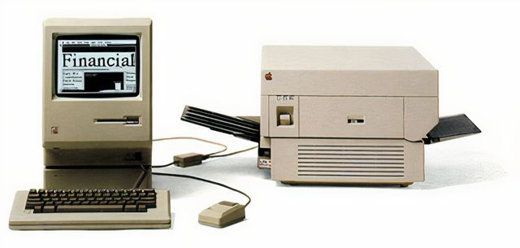

export const meta = require('./metadata.json')

This story begins in 1984. Involves the major R&D companies in Silicon Valley. Machinery. Tech revolutions. And finally, the web.
**It's the story of the web fonts**. Why are so many? And why it's so difficult to get a standard?

Fonts are important since printing became important for the general public. In 1984 the first laser printer intended for mass-market sales was launched. The [HP LaserJet](https://en.wikipedia.org/wiki/HP_LaserJet) was born and with it Silicon Valley, as well.

This event will change the world dramatically. This is the cradle for the modern digital era. And one fundamental aspect of these ages is the speed. Only one year later, 2 other mastodons of the industry join forces to compete against HP. In 1985, Apple - with the help of Adobe - will release the [LaserWriter](https://en.wikipedia.org/wiki/LaserWriter).



This new machine has something completely new. A revolutionary idea. It incorporates a built-in PostScript interpreter. Hence, in combination with an editor program, **anyone could create, publish and distribute their own content**. It's the beginning of the [Desktop Publishing revolution](https://en.wikipedia.org/wiki/Desktop_publishing).

## The fonts

You might hear about this story before. And probably you're now wondering what's Adobe's role in this play? And how exactly is this connected to the web fonts?

Adobe licensed to Apple the first 13 mass-market distributed font faces. Times, Helvetica, Courier and Symbol. Four variants of each but for the Symbol who had only one. Later on, the _LaserWriter Plus_ will introduce 22 additional new fonts. Nowadays iconic font faces such as AvantGarde, New Century or Bookman. But more interestingly, why they choose these original fonts?

**Because of technical limitations**. Times, Helvetica and Courier are easy to print. They don't need much detail. And printers only need simple roller movements. Before the Desktop Publishing revolution, IBM was selling 600dpi printers at 21.000$. The *LaserWriter* had a starting price of 6.900$.

## The web

Ok. Enough about the printers. What about the web? Well. We're in 1986. Silicon Valley just started. And the big fight is about operating systems. And a decade later, will be about the web. More specifically about the browser control.

The details of this part are loose. There are no official records but a bunch of declarations from key members of different companies at that time. Long story short. Monotype was about to go bankrupt. This is the company that created most of the fonts we use today. Arial, Baskerville, Gothic, Bodoni, Gill, etc. Some of these fonts were part of the printers aforementioned. So, who came to the rescue? **Non-other than Microsoft**.

Monotype became bedfellow with Microsoft. They designed a set of analogous fonts for the Redmon company. These new fonts were copies of the other licensed ones. And this started a legal war with many implicated parts. I don't know all the nuts and bolts but the result is clear. We don't have standard fonts. We have clones.

The good part is that the **Microsoft fonts are almost identical to the original ones**. With a bit of classic CSS, we can use a combination of them to create some sort of pseudo-standard.

This is the closest we can get to a **common font face set** in the modern world. It's also the explanation of why there's no standard nor a list of web-safe fonts.

Anyway, **the CSS rules below are safe to use in any combination of browsers and OS**. Embrace them, we need it.

<style jsx>{`
  code span:nth-child(-n + 17) {
    font-family: Times, 'Times New Roman', serif;
    font-size: 1.125rem;
  }
  code span:nth-child(n + 18):nth-child(-n + 32) {
    font-family: Helvetica, Arial, sans-serif;
    font-size: 1rem;
  }
  code span:nth-child(n + 33) {
    font-family: Courier, 'Courier New', monospace;
    font-size: 1rem;
  }
`}</style>

```css
.font-serif {
  font-family: Times, 'Times New Roman', serif;
}

.font-sans {
  font-family: Helvetica, Arial, sans-serif;
}

.font-mono {
  font-family: Courier, 'Courier New', monospace;
}
```
